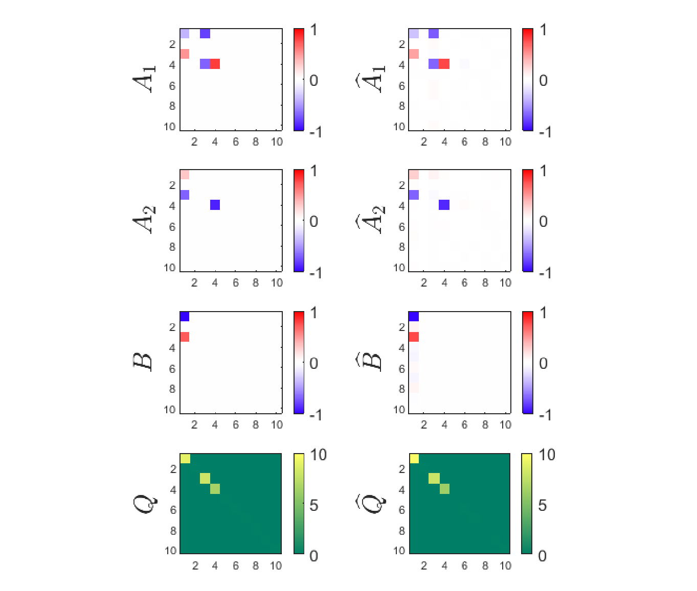

# SparsePELS
Sparse Parameter Estimation for Linear Dynamical Systems

Description: This repository contains implementations of the sparse parameter estimation for linear dynamical systems.

Copyright (c) 2020 Behrad Soleimani All Rights Reserved

Contact: behrad@umd.edu

Citation: If you find these piece of codes helpful in your reserach, please cite the following paper

- B. Soleimani, P. Das, J. Kulasingham, J. Z. Simon and B. Babadi, "Granger Causal Inference from Indirect Low-Dimensional Measurements with Application to MEG Functional Connectivity Analysis," 2020 54th Annual Conference on Information Sciences and Systems (CISS), Princeton, NJ, USA, 2020, pp. 1-5, [doi: 10.1109/CISS48834.2020.1570617418](https://ieeexplore.ieee.org/abstract/document/9086218).

Date: May 3, 2020

Requirements: implemented in Matlab R2019a version, but should run on most versions.

Contents: 
> main.m:       **Master script**. 

> SparsePELS.m:       **SparsePELS algorithm**. 

> EM.m:       **Expectation maximization (EM) algorithm**.

> EStep.m:       **Expectation (E-) step**.

> IRLS.m:       **Iteratively re-weighted least square (IRLS) algorithm**.

> MStep.m:       **Maximization (M-) step**.

> VARGenerator.m:       **VAR process generator**.

> redblue.m:  **Red-Blue color map**.

> SparsePELS.pdf: **Derivation and details of the algorithm**.

Instructions: Simple and easy. Download all the codes in a directory and run main.m, that will generate one example described below. To use the functions individually, please look at the function descriptions. The derivations and details are also explained in .pdf file.

Example:

We consider the following observation model

  

where xt and yt represent the observation and source vectors at t-th time sample, respectively. The underlying source dynamic is modeled via a vector autoregressive process, VAR(p), as

  

where et shows the (external) stimuli vector corresponding to the t-th time sample. The goal is to find the corresponding sources' dynamic, i.e., Ak (k=1,...,p), B, and Q given the indirect observations. Although the observations are low-dimensional compare to the sources, sparsity enables to accurately estimate the source activities.

In this example, we assume there are Ny=5 observations, Nx=10 sources, and T=200 time samples. The underlying source dynamic is considered as VAR(2). There are 3 active sources with unknown indices.

In Fig.1, the estimation and ground truth versions of the VAR coefficients along with the noise covariance matrix are demonstrated. The overall relative error between estimation and ground truth is less than 8%. 

|  | 
|:--:| 
| Fig 1. Comparison of the estimation and ground truth versions.|
